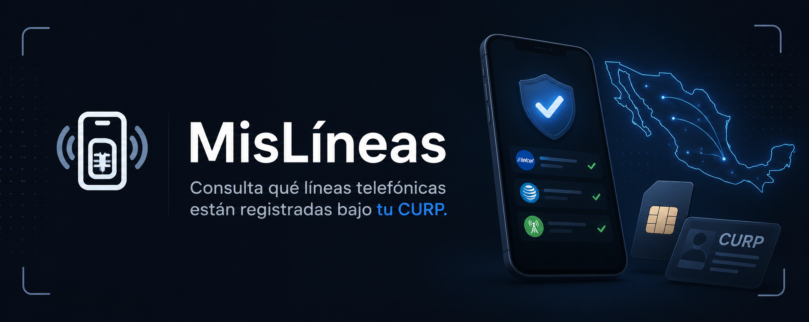

<p align="center">
  
</p>

<h1 align="center">MisLíneas</h1>

<p align="center">
  Consulta qué líneas telefónicas están registradas bajo tu CURP en México.
</p>

---

## Sobre el proyecto

En México no existe una plataforma centralizada donde una persona pueda verificar todas las líneas telefónicas asociadas a su identidad.  
Dependiendo de la operadora, el proceso puede implicar entrar a decenas de portales distintos — o simplemente no existir de forma pública.

MisLíneas nace para resolver ese problema en una sola consulta.

La aplicación revisa en paralelo los mecanismos de verificación disponibles de operadores y OMVs, y muestra los resultados conforme cada proveedor responde. El objetivo es simple: permitirle a cualquier persona saber si hay líneas registradas a su nombre sin tener que navegar por más de cien sitios distintos.

---

## El problema

Registrar una línea usando el CURP de otra persona es mucho más común de lo que debería.

Eso puede terminar en:

- fraude
- robo de identidad
- líneas utilizadas para actividades ilícitas
- personas vinculadas a números que nunca contrataron

La falta de una herramienta centralizada convierte algo básico — saber qué líneas existen a tu nombre — en un proceso fragmentado y poco transparente.

MisLíneas intenta cerrar ese vacío.

---

## Cobertura

Actualmente incluye soporte para:

- Telcel
- AT&T
- operadores sobre Red Altán
- más de 80 OMVs en México

La lista completa y el estado de compatibilidad de cada operador se encuentra en [OPERATORS.md](OPERATORS.md).

---

## Cómo funciona

Las consultas se ejecutan en paralelo utilizando `Promise.allSettled`, mientras que los resultados se transmiten como stream NDJSON para que la interfaz pueda mostrar respuestas en tiempo real sin esperar a que terminen todos los proveedores.

Toda la aplicación corre del lado del cliente y no requiere infraestructura adicional ni servicios externos.

---

## Desarrollo

Requisitos:

- Node.js
- pnpm

Instalación:

```bash
pnpm install
pnpm dev
```

Build de producción:

```bash
pnpm build
pnpm start
```

No requiere variables de entorno ni API keys externas.

---

## Stack

MisLíneas está construido con:

- Next.js
- React 19
- TypeScript
- Tailwind CSS 4

La aplicación utiliza App Router y una arquitectura enfocada en streaming y renderizado progresivo de resultados.

---

## Derechos ARCO

Si encuentras líneas que no reconoces, la aplicación incluye información sobre cómo iniciar solicitudes ARCO ante las operadoras correspondientes.

ARCO hace referencia a los derechos de:

- Acceso
- Rectificación
- Cancelación
- Oposición

---

## Contexto legal

Esta herramienta está diseñada para consultar información asociada a tu propio CURP.

Consultar CURPs de terceras personas sin consentimiento puede ser contrario a la Ley Federal de Protección de Datos Personales en Posesión de los Particulares y otras disposiciones aplicables en México.

El usuario es responsable del uso que haga de la herramienta.

---

## Autor

Desarrollado por Jorge Mora  
GitHub: [@moraxh](https://github.com/moraxh)